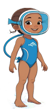

**Esta es Lina, tu personaje principal.**

 **Estas son las perlas que debes recoger para formar la Perla de Luz, recógelas todas antes de que acabe el tiempo.**

  **Cuidado con las medusas que intentarán detenerte, si las tocas perderás 20 segundos de tu tiempo.**

  **Para ayudarte en tu misión las burbujas de aire te darán 10 segundos extra, atrápalas antes de que desaparezcan.**

**🔴Usa las teclas ⬅ y ➡ para moverte y ⬆ para saltar.**

**⏳ Recuerda que solo tienes 1 minuto.**

<a href="https://aymee10.github.io/Aventura-marina/" style="background-color:#005F99; color:white; padding:10px 15px;text-decoration:none;border-radius:5px;">A Jugar</a>

