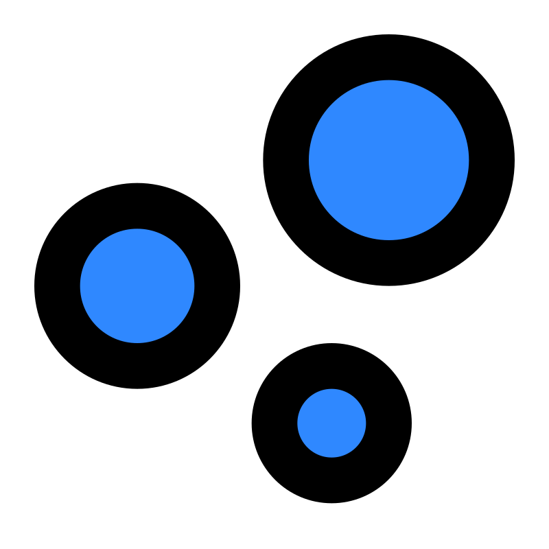

  **Estas son las perlas que debes recoger para formar la Perla de Luz, recógelas todas antes de que acabe el tiempo.**

   **Cuidado con las medusas que intentarán detenerte, si las tocas perderás 20 segundos de tu tiempo.**

   **Para ayudarte en tu misión las burbujas de aire te darán 10 segundos extra, atrápalas antes de que desaparezcan.**

###  Usa las teclas
### ⬅ Para moverte a la izquierda
### ➡ Para moverte a la derecha
###  ⬆ Para saltar.

  **Puedes ver en la parte superior tu puntuación y el tiempo restante actualizado cada segundo**
  **También puedes pausar o reproducir la música cuando desees en la esquina superior derecha**

## ⏳ Recuerda que solo tienes 1 minuto.

  

                     

